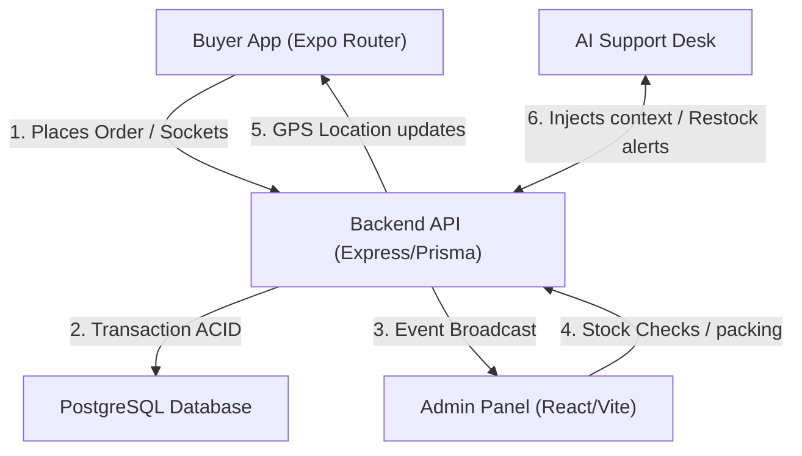

# 🛒 [APP] Workflow Orchestrator

Use this skill to guide the integration and verification of business processes across the [APP] codebase. It ties the frontend client, admin panel, backend service database, real-time streams, and customer support desks together.

---

## 📋 Unified Business Pipelines

### 🛍️ Pipeline A: Order Placement & Inventory Check
1. **Client Request**: The buyer selects items in the Mobile Catalog (`skill-react-native`, `skill-expo`).
2. **Checkout Validation**: The mobile app triggers biometric validation (`skill-expo`) for high-value orders and transmits details via secure endpoints (`skill-expressjs`).
3. **Transaction Execution**: The backend (`skill-nodejs`, `skill-prisma-orm`) starts an ACID transaction (`skill-postgresql`). It verifies stock levels:
   - If stock is sufficient, it creates the `Order` record, reduces the stock, commits the transaction, and returns `status: PENDING`.
   - If stock is insufficient, it rolls back the transaction and informs the client.
4. **WebSocket Update**: The backend emits an `order:created` event via Socket.io (`skill-socketio`) to the employee dashboard room.

### 📦 Pipeline B: Employee Packing & Out-of-Stock Support
1. **Dashboard Packing List**: Employees view pending orders in the Admin Dashboard (`skill-react-vite`, `skill-tailwindcss`).
2. **Item Collection**: As the employee packs items, if they discover that a physical item is missing/damaged (real stock differs from DB), they mark a "Stock Alert" status in the Admin Web.
3. **AI Support Trigger**: The server invokes the AI Assistant (`skill-ai-orchestration`, `skill-llm-integration`, `skill-prompt-engineering`) to analyze the issue:
   - The AI inspects the buyer's purchase history and other similar catalog products with high stock.
   - It suggests a replacement item (e.g. *"We don't have Brand A milk, would you like to replace it with Brand B milk at no extra charge?"*).
   - This replacement request is pushed to the user's mobile screen in real-time via Socket.io (`skill-socketio`).
4. **Buyer Confirmation**: Once the buyer clicks "Accept" on their screen, the order status changes to `PACKED` and the DB is updated.

### 🚚 Pipeline C: Delivery Dispatch & Real-Time Tracking
1. **Driver Assignment**: The employee sets the order status to `SHIPPED` and assigns it to an active delivery driver in the Admin Web.
2. **Optimized Route**: The backend calls the Routing Agent (`skill-ai-orchestration`) to optimize coordinates and display the route on the driver's screen (`skill-react-native`).
3. **Live GPS Stream**: The driver's app streams GPS location data via Sockets (`skill-socketio`) every 5 seconds.
4. **Buyer Live Map**: The buyer's app listens to the socket stream and updates the courier icon on the interactive map (`skill-react-native`) in real-time.
5. **Completion**: Upon delivery, the driver marks it as `DELIVERED`. The server records final metrics and resets client AI billing quotas (`skill-api-ai-billing`).
