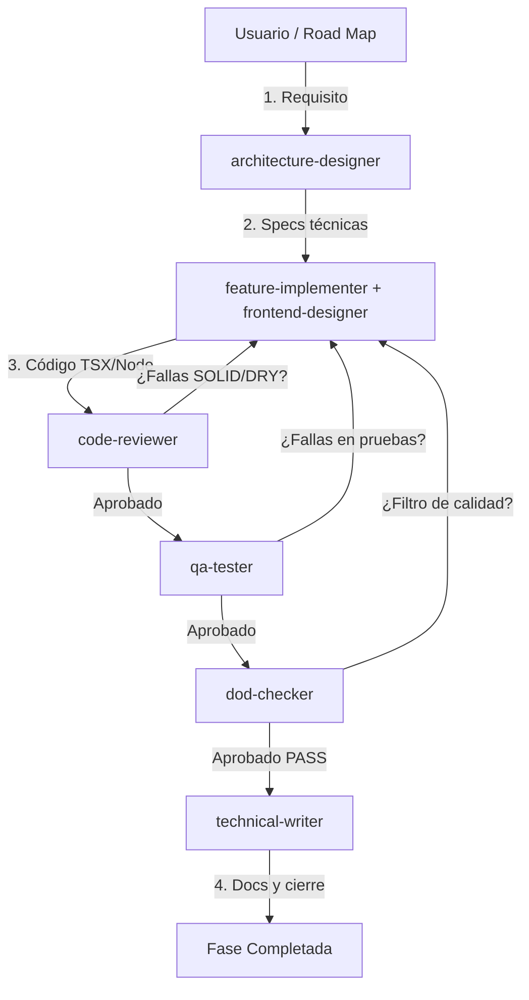

# AGENTS.md — Skill System (Portable 2026, pnpm)

Este archivo guía a los agentes de IA (Claude Code, Cursor, OpenCode, Copilot, Codex) que trabajan con esta colección de skills. Las skills son agnósticas al proyecto: úsalas en cualquier monorepo.

## 📂 Categorías de Skills

| Categoría | Path | Skills |
|---|---|---|
| Planning & Process | `01-planning-process/` | project-tracker, tech-stack-advisor, application-workflow, master-prompt, agents, engram-integration, speckit-integration, session-notes, parallelization, tech-escalation-adr, idea-to-prd-express, jira-epic, jira-task, brainstorming |
| Dev Roles (SDD) | `02-dev-roles/` | architecture-designer, code-reviewer, dod-checker, expert-debugger, security-audit, feature-implementer, frontend-designer, frontend-design, judgment-day, decision-gate, github-pr, performance-refactor, qa-tester, technical-writer, hexagonal-architecture-layers-java, systematic-debugging, verification-before-completion |
| AI / ML | `03-ai-ml/` | ai-orchestration, ai-scalability-mlops, api-ai-billing, llm-integration, ai-sdk-5, prompt-engineering, research-first |
| Backend | `04-backend/` | docker, error-handling, mcp-integration, api-design, expressjs, jwt-bcrypt, microservices, nodejs, payments, postgresql, prisma-orm, socketio, django-drf, java-21, spring-boot-3 |
| Frontend | `05-frontend/` | electronjs, electron, expo-production-auditor, maps-gps, nextjs, nextjs-15, push-notifications, pwa-capacitor, react-native, react-vite, react-19, ai-ui-generation, tailwindcss, tailwind-4, zod-4, zustand-5, angular-core, angular-forms, angular-performance, angular-architecture, state-management, vercel-react-best-practices, vercel-composition-patterns, vercel-react-view-transitions, web-design-guidelines, interface-design |
| Code Quality | `06-code-quality/` | pnpm-workspaces, turborepo, biome, changesets, env-management, solid-clean-code, typescript, dependency-guardian, elixir-antipatterns, changelog-generator |
| Testing | `07-testing/` | testing-patterns, playwright, pytest |
| DevOps | `08-devops/` | ci-cd, kill-switches, monitoring, observability |
| SDD Planning | `professional-planner/` | professional-planner (Spec-Driven Development) |
| Meta-Skills | `00-meta-skills/` | skill-creator, skill-sync, skill-validator, skill-router, skill-loader |

## 🔄 Ciclo de Desarrollo (9 Agentes con SDD)



1. **Planificación y SDD (Fases 1-4):** El `professional-planner` guía la definición de requisitos (PRD), diseño de arquitectura de tipos e interfaces, y división en tareas SPEC antes de que los agentes empiecen a codificar.
2. **Construcción (Fase 5):** `feature-implementer` + `frontend-designer` escriben el código de producción.
3. **Control de Calidad (Triángulo de Acero):**
   - `code-reviewer` audita SOLID/DRY/KISS.
   - `qa-tester` ejecuta suites de pruebas e integra test-driven development (TDD).
   - `dod-checker` actúa como gatekeeper final. **Ninguna fase se marca completada sin su PASS.**
4. **Cierre y Verificación (Fase 6):** `technical-writer` documenta endpoints y se ejecutan las auditorías de compilación para producción móvil y monorepo.

## 🚦 Reglas Globales (con Don't/Do pareados)

- **Nunca** almacenar JWT en LocalStorage/AsyncStorage. **Usar**: access tokens en memoria (variable de módulo), refresh tokens en HTTP-only cookies con flag `Secure` y `SameSite=Strict`.
- **Nunca** procesar payloads de Socket.io sin validar. **Usar**: esquemas Zod compartidos en `packages/contracts/` antes de cualquier lógica de negocio.
- **Nunca** usar `any` en TypeScript. **Usar**: `unknown` + narrowing con Zod, o tipos explícitos del dominio.
- **Nunca** escribir código nuevo sin pasar por SDD. **Usar**: invocar `professional-planner` para features que tocan 2+ archivos o 2+ dominios de negocio.
- **Siempre** usar `pnpm expo install` para paquetes móviles nativos. **Nunca** `pnpm add` directo, ya que rompe la compatibilidad con el SDK de Expo. Validar después con `dependency-guardian`.
- **Siempre** correr `pnpm expo prebuild --clean` antes de un EAS build. **Usar**: la skill `expo-production-auditor` para auditar 4 frentes (circular deps, Hermes, assets, sync de deps nativas).
- **Siempre** registrar decisiones arquitectónicas y bugs complejos. **Usar**: la skill `tech-escalation-adr` para ADRs y `expert-debugger` para postmortems.
- **Stack base recomendado**: Node/Express/Prisma/PostgreSQL + React/Vite/Tailwind + Expo Router. Cualquier cambio o adición al stack debe proponerse mediante un ADR de la skill `tech-escalation-adr`.

## 🤖 Auto-Invoke List (root)

Cuando el agente detecte las siguientes acciones, **debe** cargar la skill correspondiente ANTES de actuar.

> **Two-tier loading (PrD blindaje):**
> - **Tier 0 (siempre cargadas, ~12 skills, ~2K tokens):** `skill-router`, `skill-validator`, `skill-creator`, `skill-sync`, `professional-planner`, `idea-to-prd-express`, `agents`, `project-tracker`, `session-notes`, `engram-integration`, `kill-switches`, `dod-checker`.
> - **Tier 1 (on-demand via `skill-router`):** las skills restantes. El router decide cuáles cargar por turn — el agente solo carga Tier 1 skills listadas en `tier1toLoad` del output del router.
>
> **Antes de cualquier turn que pueda invocar otra skill, correr `skill-router` primero:**
> ```bash
> node ./00-meta-skills/skill-router/scripts/skill-router.mjs --query "<task>" [--diff <staged-lines>] [--json]
> ```
| Crear/modificar schema Prisma | `04-backend/prisma-orm` + `06-code-quality/solid-clean-code` |
| Crear/modificar endpoint Express | `04-backend/expressjs` + `04-backend/error-handling` + `04-backend/api-design` |
| Crear/modificar pantalla Expo | `05-frontend/expo-production-auditor` + `05-frontend/react-native` |
| Implementar tracking GPS | `05-frontend/maps-gps` + `04-backend/socketio` |
| Crear test suite | `07-testing/testing-patterns` |
| Review de PR | `02-dev-roles/code-reviewer` + `06-code-quality/solid-clean-code` |
| Auditoría final de fase | `02-dev-roles/dod-checker` |
| Commit/push a repo | `08-devops/ci-cd` + `01-planning-process/project-tracker` (decision log) |
| Decisión arquitectónica | `01-planning-process/tech-escalation-adr` |
| Bug complejo / no obvio | `02-dev-roles/expert-debugger` + `02-dev-roles/systematic-debugging` |
| Security audit / vulnerability scan | `02-dev-roles/security-audit` |
| Performance issues | `02-dev-roles/performance-refactor` + `05-frontend/vercel-react-best-practices` |
| Crear nueva skill | `00-meta-skills/skill-creator` |
| Sincronizar skills cross-tool | `00-meta-skills/skill-sync` |
| Validar SKILL.md contra spec | `00-meta-skills/skill-validator` |
| Cargar skills por turno / telemetría de sesión | `00-meta-skills/skill-loader` |
| Iniciar feature >1 archivo | `professional-planner` (SDD) |
| Configurar env vars / secrets | `06-code-quality/env-management` |
| Error handling / Result types | `04-backend/error-handling` |
| Configurar MCP servers | `04-backend/mcp-integration` |
| Build cache / parallel execution | `06-code-quality/turborepo` |
| Lint + format (Biome) | `06-code-quality/biome` |
| Versioning / changelog / release | `06-code-quality/changesets` + `06-code-quality/changelog-generator` |
| Investigar / research / spike | `03-ai-ml/research-first` |
| Brainstorming de ideas y specs | `01-planning-process/brainstorming` |
| Usar spec-kit / speckit | `01-planning-process/speckit-integration` |
| Cierre de sesión / guardar contexto | `01-planning-process/session-notes` |
| Procesos paralelos / multi-agente | `01-planning-process/parallelization` |
| Detener agente / kill switch | `08-devops/kill-switches` |
| Diseño visual / branding / anti-AI-slop | `02-dev-roles/frontend-design` |
| Diseño de UI para Dashboard / SaaS / Admin | `05-frontend/interface-design` |
| Guías de interfaz web y accesibilidad | `05-frontend/web-design-guidelines` |
| Optimización y performance React / Next.js | `05-frontend/vercel-react-best-practices` |
| Patrones de composición React / compound components | `05-frontend/vercel-composition-patterns` |
| Animaciones con React View Transitions | `05-frontend/vercel-react-view-transitions` |
| Verificación estricta antes de completar PR/tarea | `02-dev-roles/verification-before-completion` |
| Review adversarial paralelo (2 jueces) | `02-dev-roles/judgment-day` |
| Pre-commit AI review (gga) | `02-dev-roles/code-reviewer` (`references/pre-commit-gga.md`) |
| PR / conventional commits | `02-dev-roles/github-pr` |
| Memoria cross-session (Engram) | `01-planning-process/engram-integration` |
| React 19 (Compiler, use()) | `05-frontend/react-19` |
| Next.js 15 (App Router) | `05-frontend/nextjs-15` |
| Tailwind 4 (cn(), theme) | `05-frontend/tailwind-4` |
| Zod 4 (validation, v3 breaking) | `05-frontend/zod-4` |
| Zustand 5 (state) | `05-frontend/zustand-5` |
| Angular (signals/zoneless) | `05-frontend/angular-core` + `angular-forms` + `angular-performance` + `angular-architecture` |
| Playwright E2E | `07-testing/playwright` |
| Vercel AI SDK 5 (chat/streaming) | `03-ai-ml/ai-sdk-5` |
| UI generada con IA (Stitch/v0/Lovable) | `05-frontend/ai-ui-generation` |
| Idea → PRD express (20 min) | `01-planning-process/idea-to-prd-express` |
| Response shape / ID mismatch / data shape | `04-backend/api-response-normalizer` |
| Auth / login / cookies / interceptor | `02-dev-roles/auth-flow-audit` |
| Booking / reserva / slots / disponibilidad | `04-backend/booking-scheduling-domain` |
| Background jobs / colas / recordatorios / BullMQ | `04-backend/background-jobs-queues` |
| Build config / postcss / tailwind config | `06-code-quality/build-config-validator` |
| Deep link / universal link / compartir | `05-frontend/deep-linking-mobile` |
| Design tokens / color scale / spacing / design system | `05-frontend/design-system-tokens` |
| File upload / imagen / galería / multer / S3 | `04-backend/file-uploads-storage` |
| Form validation / React Hook Form / Zod | `05-frontend/forms-validation-react` |
| Debug visual frontend / CSS no carga | `02-dev-roles/frontend-debugging-protocol` |
| Multi-idioma / i18n / traducciones | `05-frontend/i18n-localization` |
| Lazy load / code split / heavy deps | `05-frontend/lazy-loading-patterns` |
| Lottie / onboarding / empty state / success animation | `05-frontend/lottie-animations` |
| Micro-interactions / hover / press / stagger / shimmer | `02-dev-roles/micro-interactions` |
| prefers-reduced-motion / animation performance / 60fps | `05-frontend/motion-accessibility` |
| Framer Motion / animation / spring / AnimatePresence | `05-frontend/motion-framer` |
| GSAP / timeline / SplitText / MorphSVG / Flip | `05-frontend/motion-gsap` |
| dotenv / env vars undefined / ESM imports | `04-backend/nodejs-module-loading` |
| Notificaciones / email / SMS / multichannel | `04-backend/notifications-multichannel` |
| Offline / sync / sin conexión / queue | `05-frontend/offline-sync-mobile` |
| Page transition / route transition / shared element | `05-frontend/page-transitions` |
| Prisma → frontend types / [object Object] | `04-backend/prisma-frontend-types` |
| Rate limiting / 429 / throttle | `04-backend/rate-limiting-design` |
| Reportes / PDF / CSV / exportar | `04-backend/reports-exports` |
| Scroll animation / parallax / scroll reveal | `05-frontend/scroll-animations` |
| App Store / Play Store / EAS / deploy | `08-devops/store-deployment-eas` |
| Glassmorphism / gradients / shadows / visual effects | `05-frontend/visual-effects` |
| Instalar paquete / nuevo import / pre-commit gate | `06-code-quality/dependency-guardian` (`scripts/check-pkg-exists.mjs --staged`) |
| Decisión humana final / trade-off matrix / go-no-go | `02-dev-roles/decision-gate` |
| Antes de invocar cualquier skill (pre-routing determinista) | `00-meta-skills/skill-router` |
| Crear/modificar endpoint Django / DRF | `04-backend/django-drf` |
| Crear/modificar app Electron | `05-frontend/electron` + `05-frontend/electronjs` |
| Review/escribir código Elixir | `06-code-quality/elixir-antipatterns` |
| Diseño de arquitectura limpia en Java / Hexagonal | `02-dev-roles/hexagonal-architecture-layers-java` |
| Escribir código Java moderno / virtual threads | `04-backend/java-21` |
| Crear/modificar ticket u Epic de Jira | `01-planning-process/jira-epic` + `01-planning-process/jira-task` |
| Escribir tests unitarios en Python / pytest | `07-testing/pytest` |
| Crear/modificar servicio Spring Boot | `04-backend/spring-boot-3` |

**Regla de los 3 capas**: si la acción toca 2+ skills de categorías distintas, invocar `professional-planner` primero para confirmar la SDD-phase apropiada.

## 📦 Uso

Cada skill se activa automáticamente cuando el agente detecta su `description` en el frontmatter. Para invocación manual:

- Claude Code / OpenCode: `/nombre-de-la-skill`
- Codex: `$nombre-de-la-skill`
- Cursor: invocación por nombre en el chat

El archivo `SKILLS.md` contiene el índice completo con paths y descripciones.

## 🛠️ Instalación rápida en cualquier proyecto

```bash
# Desde este directorio
node ./00-meta-skills/skill-sync/scripts/install-skills.mjs --target <ruta-del-proyecto>

# Ejemplo genérico
node ./00-meta-skills/skill-sync/scripts/install-skills.mjs --target "C:\ruta\al\proyecto"
```

Esto copia las skills a `.claude/skills/`, `.gemini/skills/`, `.codex/skills/`, `.cursor/skills/` (según lo que detecte instalado).

## 🎩 Companion tooling (opcional, binarios installables)

Estos proyectos de [Gentleman Programming](https://github.com/Gentleman-Programming) complementan el catálogo con binarios instalables (no son skills — son herramientas):

| Herramienta | Qué añade | Instalación |
|---|---|---|
| [Engram](https://github.com/Gentleman-Programming/engram) | Memoria persistente cross-session via MCP (mem_save/mem_search/mem_judge...). Cables skills vía `engram-integration`. | `brew install gentleman-programming/tap/engram && engram setup <agent>` |
| [Gentle-AI](https://github.com/Gentleman-Programming/gentle-ai) | Ecosistema que configura agentes con Engram + SDD workflow + skills + persona + perfiles por fase + delegation triggers. | `brew install gentleman-programming/tap/gentle-ai && gentle-ai install` |
| [GGA](https://github.com/Gentleman-Programming/gentleman-guardian-angel) | Code review pre-commit provider-agnostic. Cables skills vía `code-reviewer/references/pre-commit-gga.md`. | `brew install gentleman-programming/tap/gga && gga init && gga install` |
| [Gentleman.Dots](https://github.com/Gentleman-Programming/Gentleman.Dots) | Dev environment (Neovim/LazyVim, shells, tmux, terminales). Instálalo primero para el editor, después apila gentle-ai encima. | `brew install gentleman-programming/tap/gentleman-dots && gentleman-dots` |

Instalación en Windows: reemplazar `brew` por `scoop bucket add gentleman https://github.com/Gentleman-Programming/scoop-bucket && scoop install <tool>`. Si no tienes scoop, descarga los binarios directly de GitHub Releases y ubicalos en `~/bin` (añade `~/bin` al PATH del usuario). Engram soporta setup para 12 agentes vía `engram setup <n>`; DeepSeek IDE no está en la lista nativa — configúralo vía MCP stdio genérico (cualquier agente MCP-compatible puede llamar `engram mcp`). GGA es Bash puro — requ híbrido Git Bash o WSL: `git clone … && bash install.sh`. Alternativa para Windows: usar `engram` + `gentle-ai` (binarios nativos) y dejar GGA para cuando tengas Git Bash interactivo.


